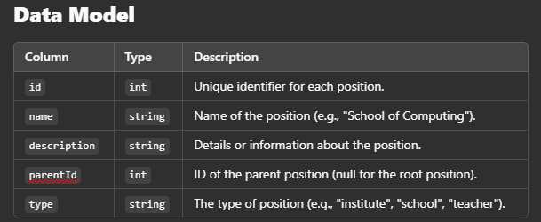

# University Hierarchy SPA

## **Overview**

This project is a Single Page Application (SPA) designed to manage and display a hierarchical structure of a university. The application allows CRUD operations for hierarchical positions, including the following:

- **University President** → Root
- **Institute** → Level 1
- **School** → Level 2
- **Department** → Level 3
- **Teacher** → Leaf Nodes

## **Features**

- **Dynamic Tree View**: Visualize the hierarchy in an expandable/collapsible tree structure.
- **CRUD Operations**:
  - Add, edit, or delete nodes in the hierarchy.
- **Interactive Forms**:
  - Create and update nodes with validation.
- **API Integration**:
  - Connect to REST APIs for data storage and retrieval.
- **Responsive UI/UX**:
  - Built with modern design principles.

---

## **Hierarchy Example**

```text
University President
├── Institute of IoT
│   ├── School of Computing
│   │   ├── Department of Computer Science
│   │   │   ├── Teacher A
│   │   │   └── Teacher B
│   │   ├── Department of Software Engineering
│   │       ├── Teacher C
│   │       └── Teacher D
│   ├── School of Electrical and Mechanical
│   │   ├── Department of Electrical eng.
│   │   │   ├── Teacher E
│   │   │   └── Teacher F
│   │   ├── Department of Mechanical eng
│   │       ├── Teacher G
│   │       └── Teacher H
│   ├── School of Civil
│       ├── Department of COTOM
│       │   ├── Teacher I
│       │   └── Teacher J
│       └── Department of Civil
│           ├── Teacher K
│           └── Teacher L
├── Institute of Social Science
│   ├── School of Humanities
│   │   ├── Department of History
│   │   │   ├── Teacher M
│   │   │   └── Teacher N
│   │   ├── Department of Literature
│   │       ├── Teacher O
│   │       └── Teacher P
│   ├── School of Behavioral Studies
│   │   ├── Department of Psychology
│   │   │   ├── Teacher Q
│   │   │   └── Teacher R
│   │   ├── Department of Sociology
│   │       ├── Teacher S
│   │       └── Teacher T
│   ├── School of Social Policy
│       ├── Department of Public Policy
│       │   ├── Teacher U
│       │   └── Teacher V
│       └── Department of Political Science
│           ├── Teacher W
│           └── Teacher X

# Technical Requirements

## Frontend

Framework: React

UI Library: Mantine| shadcn

Styles: TailwindCSS

Forms: React Hook Form with optional validation using Zod

HTTP Client: Axios

State Management

Redux Toolkit: For managing the application state.

Utilities

Lodash: For data handling (e.g., tree structure).

## Backend

API: REST API using Firebase Database REST API, Mockoon, or other mock APIs


## Installation

1. Clone the Repository

git clone <repository-url>
cd react-base-code

2. Install Dependencies

npm install or npm install --legacy-peer-deps

3. Start the Development Server

npm start

# Usage

## Add a Position

Click on a node in the hierarchy.

Click "Add" and fill in the form.

Submit to save the position.

## Edit a Position

Select a node in the hierarchy.

Click "Edit" and update the details.

Submit to save changes.

## Delete a Position

Select a node in the hierarchy.

Click "Delete" to remove the position and all its children.

## Tree Rendering Logic

function renderTree(node, data) {
  const children = data.filter(item => item.parentId === node.id);
  return (
    <ul key={node.id}>
      <li>{node.name} ({node.type})</li>
      {children.map(child => renderTree(child, data))}
    </ul>
  );
}

// Example usage
const rootNode = data.find(item => item.parentId === null);
const tree = renderTree(rootNode, data);
```
